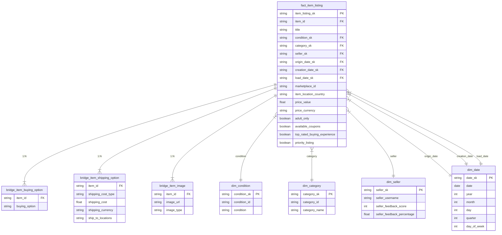

# 🛍️ eBay Analytics – Capstone Project

This project builds a data modeling solution using dbt, Snowflake and Airflow to analyze eBay item listing data.

## 🎯 Objective

To build a dimensional model (Kimball-style) of eBay listings and generate analytical marts to help businesses make informed decisions about item pricing, visibility, market trends, and performance.

## 🧱 Architecture Overview

```text
ELT Pipeline
eBay API → Snowflake (RAW → STAGING → STAR SCHEMA → MARTS) → dbt (transformations, snapshots, tests)
```

## 🧠 Key Features

- **Staging models**: Clean and flatten JSON data into tabular format.
- **Normalized models**: Dimensions like `category`, `condition`, and `seller` are normalized.
- **Star schema**: Fact table centered on item listings with surrogate keys.
- **Bridge tables**: Capture many-to-many relationships like images, shipping options, and buying methods.
- **Snapshots**: Track changes in seller data using SCD Type 2.
- **Marts**: Business-use case aggregates to answer performance and pricing questions.
- **Orchestration**: Running the pipeline, processing new data on a daily basis.

## 🔎 Business Analytics

### `mart_item_performance`

**Purpose**: Aggregate item-level metrics to understand visibility, pricing, and promotional features.

- How do pricing and listing features (like coupons) affect performance?
- Which countries in which categories consistently perform well?

### `mart_condition_price_index`

**Purpose**: Monitor pricing trends by condition.

- Are new items priced significantly higher than used ones?
- How does item condition correlate with category and value?

### `mart_category_price_bands`

**Purpose**: Evaluate category-level pricing distribution to find investment opportunities or underpriced segments.

- What’s the typical price band for items in each category?
- Are some categories more price-volatile than others?

## 🗃️ Dimensional Model Overview



### Fact Table: `fact_item_listing`

- Grain: One row per item listing.
- Contains keys to dimensions and listing metadata like price, condition, coupons, etc.

### Dimension Tables:

- `dim_condition`: Normalized item conditions.
- `dim_category`: Leaf-level eBay categories.
- `dim_seller`: With SCD Type 2 applied to capture feedback changes.
- `dim_date`: Derived from origin, creation, and load timestamps.

### Bridge Tables:

- `bridge_item_image`: All image URLs per item (thumbnail & additional).
- `bridge_item_buying_option`: Available buying methods per item.
- `bridge_item_shipping_option`: Captures all shipping options.

## 🔄 Snapshots

### `snap_seller`

Tracks SCD Type 2 changes in seller feedback data over time.

- Detects changes in feedback score and percentage.
- Used to preserve seller history while referencing in `dim_seller`.

## 🧪 Data Quality with dbt Tests

Includes:

- Uniqueness and null tests on surrogate keys.
- Relationship tests between fact and dimensions.
- Accepted values for controlled vocabularies (e.g., `priority_listing` as TRUE/FALSE).

## 📚 Technologies

| Tool      | Purpose                          |
| --------- | -------------------------------- |
| dbt       | Data transformation and modeling |
| Snowflake | Cloud data warehouse             |
| Airflow   | Orchestration                    |
| GitHub    | Source control and collaboration |

## 🗂️ Project Structure

```bash
.
├── airflow-ebay/
│   ├── dags/
│   │   ├── dbt-ebay/
│   │   │   ├── macros/
│   │   │   ├── models/
│   │   │   │   ├── staging/stg_ebay_items
│   │   │   │   │   ├── stg_ebay_items.sql
│   │   │   │   ├── core/
│   │   │   │   │   ├── bridge_item_buying_option.sql
│   │   │   │   │   ├── bridge_item_image.sql
│   │   │   │   │   ├── bridge_item_shipping_option.sql
│   │   │   │   │   ├── dim_category.sql
│   │   │   │   │   ├── dim_condition.sql
│   │   │   │   │   ├── dim_date.sql
│   │   │   │   │   ├── dim_seller.sql
│   │   │   │   │   ├── fact_item_listing.sql
│   │   │   │   ├── marts/
│   │   │   │   │   ├── mart_category_price_bands.sql
│   │   │   │   │   ├── mart_condition_price_index.sql
│   │   │   │   │   ├── mart_item_performance.sql
│   │   │   ├── tests/
│   │   │   ├── schema.yml
│   │   ├── ebay_dag.py

```

## 👤 Author

**Robert Lisziewicz**

[](https://github.com/Klavaro)
[](https://www.linkedin.com/in/róbert-lisziewicz-0105bb351/)
